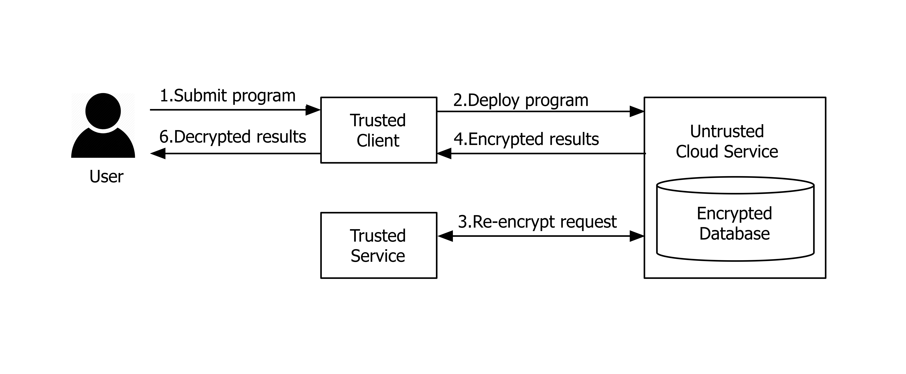

<link href="plugins/lightbox/css/lightbox.css" rel="stylesheet">
<script src="scripts/jquery.js"></script>
<script src="plugins/lightbox/js/lightbox.js"></script>

### Functionality
<p align="center">

</p>
SecureScala is a domain specific language to express secure computation in Scala without requiring any cryptographic knowledge. This means that the code can be executed on an untrusted platform without leaking any data. Computation is simply carried on encrypted data. SecureScala is based on a novel combination of free monads and free applicative functors and supports parallel execution and static analyzability. 

With SecureScala defining a secure version of WordCount is as simple as:
```scala
def wordCountText(e: EncStr): CryptoM[List[(OpeStr,Int)]] = 
              e.split("""\s+""") >>= wordCount_

def wordCount_(es: IList[EncStr]): Crypto[List[(OpeStr,Int)]] = 
              es.traverse(toOpeStr).map(
                _.groupBy(x => x).map(_.length).toList)
 ```

The current implementation of SecureScala is due to (https://github.com/markus1189)[Markus Hauck] 

### Background

Cloud computing offers an attractive and cost-efficient computing platform and hence it has been widely adopted by the industry and the government. At the same time, cloud computing poses a serious security challenge because sensitive data must often be outsourced to third party entities that can access the data and perform computations on them. Partial homomorphic encryption is promising for secure computation, since it allows programs to be executed over encrypted data. Despite advances in cryptographic techniques have improved the expressivity of such programs, integration with mainstream languages has seen little progress. 

SecureScala, allows developers to write computations over encrypted data without requiring sophisticated cryptographic knowledge, without forfeiting integration with a general-purpose language. SecureScala is based on a novel combination of a well known approach using free monads and more recent research on free applicative functors. While applicative functors are less expressive than monads, the latter suffer from the lack of static analyzability and do not allow implicit parallelism. The resulting DSL allows programmers to combine these styles, retaining the benefits of both. Since each PHE scheme supports only a limited set of operations, conversions transparent to the user allow to express programs that include unsupported operations. Different interpreters allow processing locally for testing purposes, on remote hardware in a distributed fashion, or with an optional variety of optimization such as implicit parallelism and transformations achieved via static analysis.

### More Background

Cloud computing offers on-demand provisioning of resources, seemingly unlimited scalability and other desirable properties, e.g., fault tolerance, minimal maintenance and cost reduction. To take advantage of these opportunities, the program representing a computation at hand and the associated data is uploaded into the cloud and executed there. Moving computations to the cloud, however, forces developers to face a number of security challenges. While the cloud is a viable approach for non-sensitive and public data, it is problematic for scenarios where data is sensitive, requiring protection from both adversaries and the cloud provider. Traditional encryption targeted to protect data while passing communication channels does not offer a solution for the cloud-based computation scenario because the program running on the remote hardware is not allowed to decrypt the data during the execution plain text data would be available to the owners of the remote host.

Homomorphic encryption schemes allow computations over encrypted data. Hence, private data can be uploaded to the cloud and processed in the encrypted form, without leaking information. Available homomorphic encryption schemes differ in the operations they support. Fully homomorphic encryption schemes (FHE) support at least multiplication and addition, from which all other operations can be derived. While in theory FHE seems to be the ulti- mate solution to the problem of computing over encrypted data, the computational overhead makes it unviable in practice. Partial homomorphic encryption (PHE) schemes are less expressive they support computation over encrypted data with respect to specific operations, but in contrast to FHE, exhibit acceptable performance. Examples of such schemes are Paillier (addition), ElGamal (multiplication), OPE (order comparisons) and AES (equality comparisons).

PHE schemes have been used in several systems to provide practical and provable security. Yet, these approaches adopt special-purpose languages, such as SQL or PigLatin to specify computations. A PHE embedding in a general-purpose language that enables reuse of existing libraries, fostering modularity and composition of secure computations, is still open research.


### Publications
* Markus Hauck, Savvas Savvides, Patrick Eugster, Mira Mezini and Guido Salvaneschi _SecureScala: Scala Embedding of Secure Computations_ 2016 7th ACM SIGPLAN Symposium on Scala [[pdf]](http://www.guidosalvaneschi.com/attachments/papers/2016_SecureScala-Scala-Embedding-of-Secure-Computations_pdf.pdf)
* Markus Hauck _A Platform for Secure Distributed Programming_ Master Thesis, TU Darmstadt, 2015

### About
Securescala is a project at the Software Technology Group - Technical University of Darmstadt, Germany. Many people contributed to the project:
* Markus Hauck
* Savvas Savvides
* Patrick Eugster
* Mira Mezini
* Guido Salvaneschi
